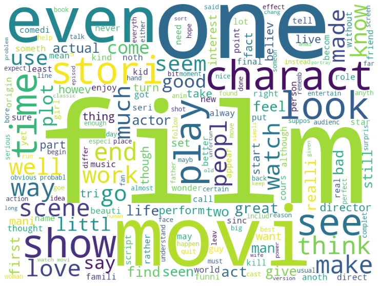
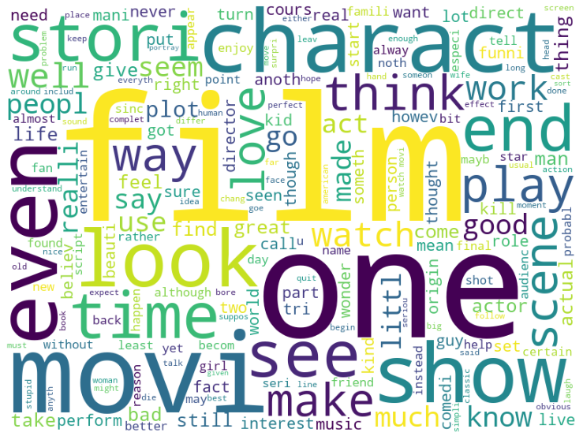
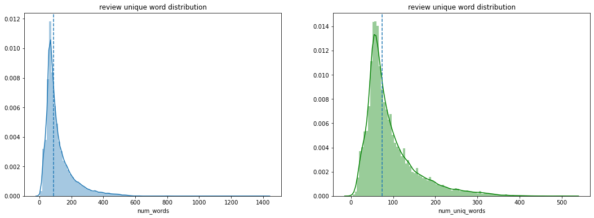
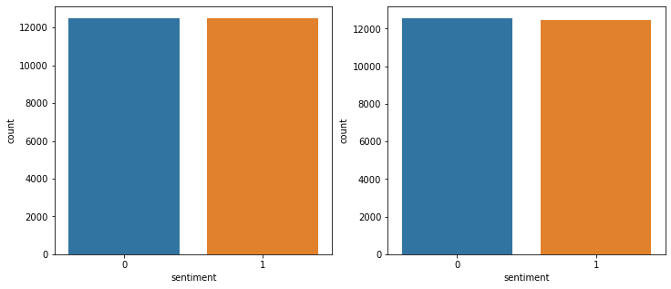

```python
import pandas as pd
import numpy as np
```

## Data Load


```python
!unzip /kaggle/input/word2vec-nlp-tutorial/labeledTrainData.tsv.zip
!unzip /kaggle/input/word2vec-nlp-tutorial/unlabeledTrainData.tsv.zip
!unzip /kaggle/input/word2vec-nlp-tutorial/testData.tsv.zip
```

    Archive:  /kaggle/input/word2vec-nlp-tutorial/labeledTrainData.tsv.zip
      inflating: labeledTrainData.tsv    
    Archive:  /kaggle/input/word2vec-nlp-tutorial/unlabeledTrainData.tsv.zip
      inflating: unlabeledTrainData.tsv  
    Archive:  /kaggle/input/word2vec-nlp-tutorial/testData.tsv.zip
      inflating: testData.tsv            


```python
PATH = '/kaggle/working/'
```


```python
train = pd.read_csv(PATH+'labeledTrainData.tsv', delimiter='\t', quoting=3)
test = pd.read_csv(PATH+'testData.tsv', delimiter='\t', quoting=3)
```


```python
train.head(3)
```


<div>
<style scoped>
    .dataframe tbody tr th:only-of-type {
        vertical-align: middle;
    }

    .dataframe tbody tr th {
        vertical-align: top;
    }

    .dataframe thead th {
        text-align: right;
    }
</style>
<table border="1" class="dataframe">
  <thead>
    <tr style="text-align: right;">
      <th></th>
      <th>id</th>
      <th>sentiment</th>
      <th>review</th>
    </tr>
  </thead>
  <tbody>
    <tr>
      <th>0</th>
      <td>"5814_8"</td>
      <td>1</td>
      <td>"With all this stuff going down at the moment ...</td>
    </tr>
    <tr>
      <th>1</th>
      <td>"2381_9"</td>
      <td>1</td>
      <td>"\"The Classic War of the Worlds\" by Timothy ...</td>
    </tr>
    <tr>
      <th>2</th>
      <td>"7759_3"</td>
      <td>0</td>
      <td>"The film starts with a manager (Nicholas Bell...</td>
    </tr>
  </tbody>
</table>
</div>


```python
train.info()
```

    <class 'pandas.core.frame.DataFrame'>
    RangeIndex: 25000 entries, 0 to 24999
    Data columns (total 3 columns):
     #   Column     Non-Null Count  Dtype 
    ---  ------     --------------  ----- 
     0   id         25000 non-null  object
     1   sentiment  25000 non-null  int64 
     2   review     25000 non-null  object
    dtypes: int64(1), object(2)
    memory usage: 586.1+ KB
    


```python
train.describe(exclude=[np.number])
```


<div>
<style scoped>
    .dataframe tbody tr th:only-of-type {
        vertical-align: middle;
    }

    .dataframe tbody tr th {
        vertical-align: top;
    }

    .dataframe thead th {
        text-align: right;
    }
</style>
<table border="1" class="dataframe">
  <thead>
    <tr style="text-align: right;">
      <th></th>
      <th>id</th>
      <th>review</th>
    </tr>
  </thead>
  <tbody>
    <tr>
      <th>count</th>
      <td>25000</td>
      <td>25000</td>
    </tr>
    <tr>
      <th>unique</th>
      <td>25000</td>
      <td>24904</td>
    </tr>
    <tr>
      <th>top</th>
      <td>"11281_2"</td>
      <td>"When i got this movie free from my job, along...</td>
    </tr>
    <tr>
      <th>freq</th>
      <td>1</td>
      <td>3</td>
    </tr>
  </tbody>
</table>
</div>


```python
train['sentiment'].value_counts()
```


    1    12500
    0    12500
    Name: sentiment, dtype: int64


```python
train['review'][0][:700]
```


    '"With all this stuff going down at the moment with MJ i\'ve started listening to his music, watching the odd documentary here and there, watched The Wiz and watched Moonwalker again. Maybe i just want to get a certain insight into this guy who i thought was really cool in the eighties just to maybe make up my mind whether he is guilty or innocent. Moonwalker is part biography, part feature film which i remember going to see at the cinema when it was originally released. Some of it has subtle messages about MJ\'s feeling towards the press and also the obvious message of drugs are bad m\'kay.<br /><br />Visually impressive but of course this is all about Michael Jackson so unless you remotely lik'


## 전처리 sample
* BeautifulSoup 으로 html 태그 제거
* 정규표현식으로 알파벳 이외의 문자 공백 제거
* NLTK 데이터를 활용 불용어(stopwords) 제거
* Stemming 을 활용하여 어간 추출


```python
!pip show BeautifulSoup4
```

    Name: beautifulsoup4
    Version: 4.9.0
    Summary: Screen-scraping library
    Home-page: http://www.crummy.com/software/BeautifulSoup/bs4/
    Author: Leonard Richardson
    Author-email: leonardr@segfault.org
    License: MIT
    Location: /opt/conda/lib/python3.7/site-packages
    Requires: soupsieve
    Required-by: google


```python
from bs4 import BeautifulSoup

example1 = BeautifulSoup(train['review'][0], 'html5lib')
print(train['review'][0][:700])
example1.get_text()[:700]
```

    "With all this stuff going down at the moment with MJ i've started listening to his music, watching the odd documentary here and there, watched The Wiz and watched Moonwalker again. Maybe i just want to get a certain insight into this guy who i thought was really cool in the eighties just to maybe make up my mind whether he is guilty or innocent. Moonwalker is part biography, part feature film which i remember going to see at the cinema when it was originally released. Some of it has subtle messages about MJ's feeling towards the press and also the obvious message of drugs are bad m'kay.<br /><br />Visually impressive but of course this is all about Michael Jackson so unless you remotely lik
    


    '"With all this stuff going down at the moment with MJ i\'ve started listening to his music, watching the odd documentary here and there, watched The Wiz and watched Moonwalker again. Maybe i just want to get a certain insight into this guy who i thought was really cool in the eighties just to maybe make up my mind whether he is guilty or innocent. Moonwalker is part biography, part feature film which i remember going to see at the cinema when it was originally released. Some of it has subtle messages about MJ\'s feeling towards the press and also the obvious message of drugs are bad m\'kay.Visually impressive but of course this is all about Michael Jackson so unless you remotely like MJ in anyw'


```python
import re

letters_only = re.sub('[^a-zA-Z]', ' ', example1.get_text())
letters_only[:700]
```


    ' With all this stuff going down at the moment with MJ i ve started listening to his music  watching the odd documentary here and there  watched The Wiz and watched Moonwalker again  Maybe i just want to get a certain insight into this guy who i thought was really cool in the eighties just to maybe make up my mind whether he is guilty or innocent  Moonwalker is part biography  part feature film which i remember going to see at the cinema when it was originally released  Some of it has subtle messages about MJ s feeling towards the press and also the obvious message of drugs are bad m kay Visually impressive but of course this is all about Michael Jackson so unless you remotely like MJ in anyw'


```python
lower_case = letters_only.lower()
words = lower_case.split()
print(len(words))
words[:10]
```

    437
    


    ['with',
     'all',
     'this',
     'stuff',
     'going',
     'down',
     'at',
     'the',
     'moment',
     'with']


```python
!pip show nltk
```

    Name: nltk
    Version: 3.2.4
    Summary: Natural Language Toolkit
    Home-page: http://nltk.org/
    Author: Steven Bird
    Author-email: stevenbird1@gmail.com
    License: Apache License, Version 2.0
    Location: /opt/conda/lib/python3.7/site-packages
    Requires: six
    Required-by: textblob, preprocessing, allennlp


```python
import nltk
nltk.download('stopwords')
nltk.download('wordnet')
```

    [nltk_data] Downloading package stopwords to /usr/share/nltk_data...
    [nltk_data]   Package stopwords is already up-to-date!
    [nltk_data] Downloading package wordnet to /usr/share/nltk_data...
    [nltk_data]   Package wordnet is already up-to-date!
    


    True


```python
from nltk.corpus import stopwords
stopwords.words('english')[:10]
```


    ['i', 'me', 'my', 'myself', 'we', 'our', 'ours', 'ourselves', 'you', "you're"]


```python
words = [w for w in words if not w in stopwords.words('english')]
print(len(words))
words[:10]
```

    219
    


    ['stuff',
     'going',
     'moment',
     'mj',
     'started',
     'listening',
     'music',
     'watching',
     'odd',
     'documentary']


## Stemming


```python
# 퍼터 스태머
stemmer = nltk.stem.PorterStemmer()
print(stemmer.stem('maximum'))
print('The stemmed form of running is : {}'.format(stemmer.stem('running')))
print('The stemmed form of runs is : {}'.format(stemmer.stem('runs')))
print('The stemmed form of run is : {}'.format(stemmer.stem('run')))
```

    maximum
    The stemmed form of running is : run
    The stemmed form of runs is : run
    The stemmed form of run is : run
    


```python
# 랭커스터 스태머
from nltk.stem.lancaster import LancasterStemmer
lancaster_stemmer = LancasterStemmer()
print(lancaster_stemmer.stem('maximum'))
print('The stemmmed form of running is : {}'.format(lancaster_stemmer.stem('running')))
print('The stemmed form of runs is : {}'.format(lancaster_stemmer.stem('runs')))
print('The stemmed form of run is {}'.format(lancaster_stemmer.stem('run')))
```

    maxim
    The stemmmed form of running is : run
    The stemmed form of runs is : run
    The stemmed form of run is run
    


```python
words[:10]
```


    ['stuff',
     'going',
     'moment',
     'mj',
     'started',
     'listening',
     'music',
     'watching',
     'odd',
     'documentary']


```python
# snowball stemmer
from nltk.stem.snowball import SnowballStemmer

stemmer = SnowballStemmer('english')
words = [stemmer.stem(w) for w in words]

# snowball stemm 처리 후
words[:10]
```


    ['stuff',
     'go',
     'moment',
     'mj',
     'start',
     'listen',
     'music',
     'watch',
     'odd',
     'documentari']


## Lemmatization


```python
from nltk.stem import WordNetLemmatizer
wordnet_lemmatizer = WordNetLemmatizer()

print(wordnet_lemmatizer.lemmatize('fly'))
print(wordnet_lemmatizer.lemmatize('flies'))

words = [wordnet_lemmatizer.lemmatize(w) for w in words]
words[:10]
```

    fly
    fly
    


    ['stuff',
     'go',
     'moment',
     'mj',
     'start',
     'listen',
     'music',
     'watch',
     'odd',
     'documentari']


## 전처리 All
* 1. BeautifulSoup 으로 html 태그 제거
* 2. 정규표현식으로 알파벳 이외의 문자 공백 제거
* 3. 소문자 변환
* 4. NLTK 데이터를 활용 불용어(stopwords) 제거
* 5. Stemming 을 활용하여 어간 추출


```python
def review_to_words(raw_review):
    # 1. HTML 제거
    review_text = BeautifulSoup(raw_review, 'html.parser').get_text()
    # 2. 영문자가 아닌 문자는 공백으로 변환
    letters_only = re.sub('[^a-zA-Z]', ' ', review_text)
    # 3. 소문자 변환
    words = letters_only.lower().split()
    # 4. stopwords 를 세트로 변환
    stops = set(stopwords.words('english'))
    # 5. stopwords 불용어 제거
    meaningful_words = [w for w in words if not w in stops]
    # 6. 어간 추출
    stemming_words = [stemmer.stem(w) for w in meaningful_words]
    # 7. 공백으로 구분된 문자열로 결합하여 결과를 반환
    return (' '.join(stemming_words))
```


```python
nltk.download('stopwords')
nltk.download('wordnet')
```

    [nltk_data] Downloading package stopwords to /usr/share/nltk_data...
    [nltk_data]   Package stopwords is already up-to-date!
    [nltk_data] Downloading package wordnet to /usr/share/nltk_data...
    [nltk_data]   Package wordnet is already up-to-date!
    


    True


```python
clean_review = review_to_words(train['review'][0])
clean_review
```


    'stuff go moment mj start listen music watch odd documentari watch wiz watch moonwalk mayb want get certain insight guy thought realli cool eighti mayb make mind whether guilti innoc moonwalk part biographi part featur film rememb go see cinema origin releas subtl messag mj feel toward press also obvious messag drug bad kay visual impress cours michael jackson unless remot like mj anyway go hate find bore may call mj egotist consent make movi mj fan would say made fan true realli nice actual featur film bit final start minut exclud smooth crimin sequenc joe pesci convinc psychopath power drug lord want mj dead bad beyond mj overheard plan nah joe pesci charact rant want peopl know suppli drug etc dunno mayb hate mj music lot cool thing like mj turn car robot whole speed demon sequenc also director must patienc saint came film kiddi bad sequenc usual director hate work one kid let alon whole bunch perform complex danc scene bottom line movi peopl like mj one level anoth think peopl stay away tri give wholesom messag iron mj bestest buddi movi girl michael jackson truli one talent peopl ever grace planet guilti well attent gave subject hmmm well know peopl differ behind close door know fact either extrem nice stupid guy one sickest liar hope latter'


```python
# 첫번째 리뷰를 대상으로 전처리 해줬던 내용을 전체 텍스트 데이터를 대상으로 처리한다.
# 전체 리뷰 데이터 수 가져오기
num_reviews = train['review'].size
num_reviews
```


    25000


```python
from multiprocessing import Pool
import numpy as np

def _apply_df(args):
    df, func, kwargs = args
    return df.apply(func, **kwargs)

def apply_by_multiprocessing(df, func, **kwargs):
    # 키워드 항목 중 workers 파라미터를 꺼냄
    workers = kwargs.pop('workers')
    # 위에서 가져온 workers 수로 프로세스 풀을 정의
    pool = Pool(processes=workers)
    # 실행할 함수와 데이터프레임을 워커의 수 만큼 나눠 작업
    result = pool.map(_apply_df, [(d, func, kwargs)
                                 for d in np.array_split(df, workers)])
    pool.close()
    # 작업 결과를 합쳐서 반환
    return pd.concat(list(result))
```


```python
%time
clean_train_reviews = apply_by_multiprocessing(\
    train['review'], review_to_words, workers=4)
```

    CPU times: user 2 µs, sys: 0 ns, total: 2 µs
    Wall time: 5.48 µs
    


```python
%time
clean_test_reviews = apply_by_multiprocessing(\
    test['review'], review_to_words, workers=4)
```

    CPU times: user 2 µs, sys: 0 ns, total: 2 µs
    Wall time: 5.72 µs
    

## WordCloud


```python
from wordcloud import WordCloud, STOPWORDS
import matplotlib.pyplot as plt
%matplotlib inline

def displayWordCloud(data=None, backgroundcolor='white', width=800, height=600):
    wordcloud = WordCloud(stopwords=STOPWORDS,
                         background_color=backgroundcolor,
                         width=width, height=height).generate(data)
    plt.figure(figsize=(15,10))
    plt.imshow(wordcloud)
    plt.axis('off')
    plt.show()
```


```python
# 학습 데이터의 모든 단어에 대한 워드 클라우드
%time
displayWordCloud(' '.join(clean_train_reviews))
```

    CPU times: user 2 µs, sys: 1e+03 ns, total: 3 µs
    Wall time: 5.96 µs
    





```python
# 단어 수
train['num_words'] = clean_train_reviews.apply(lambda x:len(str(x).split()))
#  중복을 제거한 단어수
train['num_uniq_words'] = clean_train_reviews.apply(lambda x:len(set(str(x).split())))
```


```python
# 테스트 데이터의 모든 단어에 대한 워드 클라우드
%time
displayWordCloud(' '.join(clean_test_reviews))
```

    CPU times: user 3 µs, sys: 0 ns, total: 3 µs
    Wall time: 7.39 µs
    





```python
x = clean_train_reviews[0]
x = str(x).split()
print(len(x))
x[:10]
```

    219
    


    ['stuff',
     'go',
     'moment',
     'mj',
     'start',
     'listen',
     'music',
     'watch',
     'odd',
     'documentari']


```python
import seaborn as sns

fig, axes = plt.subplots(ncols=2)
fig.set_size_inches(18,6)
print('리뷰별 단어 평균 값 : ', train['num_words'].mean())
print('리뷰별 단어 중간 값 : ', train['num_words'].median())
sns.distplot(train['num_words'], bins=100, ax=axes[0])
axes[0].axvline(train['num_words'].median(), linestyle='dashed')
axes[0].set_title('review unique word distribution')


print('review unique word mean:', train['num_uniq_words'].mean())
print('review unique word meidan', train['num_uniq_words'].median())
sns.distplot(train['num_uniq_words'], bins=100, color='g', ax=axes[1])
axes[1].axvline(train['num_uniq_words'].median(), linestyle='dashed')
axes[1].set_title('review unique word distribution')
```

    리뷰별 단어 평균 값 :  119.52356
    리뷰별 단어 중간 값 :  89.0
    review unique word mean: 94.05756
    review unique word meidan 74.0
    


    Text(0.5, 1.0, 'review unique word distribution')





## Bag-of-words model
### 사이킷런의 CountVenctorizer 를 통해 피처 생성
* 정규표현식을 사용해 토큰을 추출
* 모두 소문자로 변환시키기 때문에 good, Good, gOod이 모두 같은 특성이 됨
* 의미없는 특성을 많이 생성하기 때문에 적어도 두 개의 문서에 나타난 토큰만을 사용
* min_df로 토큰이 나타날 최소 문서 개수를 지정할 수 있음


```python
from sklearn.feature_extraction.text import CountVectorizer
from sklearn.pipeline import Pipeline

vectorizer = CountVectorizer(analyzer = 'word',
                            tokenizer = None,
                            preprocessor = None,
                            stop_words = None,
                            min_df = 2,
                            ngram_range=(1,3),
                            max_features = 20000)
vectorizer
```


    CountVectorizer(max_features=20000, min_df=2, ngram_range=(1, 3))


```python
pipeline = Pipeline([
    ('vect', vectorizer),
])
```


```python
%time
train_data_features = pipeline.fit_transform(clean_train_reviews)
train_data_features
```

    CPU times: user 3 µs, sys: 0 ns, total: 3 µs
    Wall time: 5.96 µs
    


    <25000x20000 sparse matrix of type '<class 'numpy.int64'>'
    	with 2762268 stored elements in Compressed Sparse Row format>


```python
train_data_features.shape
```


    (25000, 20000)


```python
vocab = vectorizer.get_feature_names()
print(len(vocab))
vocab[:10]
```

    20000
    


    ['aag',
     'aaron',
     'ab',
     'abandon',
     'abbey',
     'abbi',
     'abbot',
     'abbott',
     'abc',
     'abduct']


```python
# 벡터화된 피처를 확인
dist = np.sum(train_data_features, axis=0)

for tag, count in zip(vocab, dist):
    print(count, tag)

pd.DataFrame(dist, columns=vocab)
```

    [[26 48 22 ... 59 40 23]] aag
    


<div>
<style scoped>
    .dataframe tbody tr th:only-of-type {
        vertical-align: middle;
    }

    .dataframe tbody tr th {
        vertical-align: top;
    }

    .dataframe thead th {
        text-align: right;
    }
</style>
<table border="1" class="dataframe">
  <thead>
    <tr style="text-align: right;">
      <th></th>
      <th>aag</th>
      <th>aaron</th>
      <th>ab</th>
      <th>abandon</th>
      <th>abbey</th>
      <th>abbi</th>
      <th>abbot</th>
      <th>abbott</th>
      <th>abc</th>
      <th>abduct</th>
      <th>...</th>
      <th>zombi bloodbath</th>
      <th>zombi film</th>
      <th>zombi flick</th>
      <th>zombi movi</th>
      <th>zone</th>
      <th>zoo</th>
      <th>zoom</th>
      <th>zorro</th>
      <th>zu</th>
      <th>zucker</th>
    </tr>
  </thead>
  <tbody>
    <tr>
      <th>0</th>
      <td>26</td>
      <td>48</td>
      <td>22</td>
      <td>288</td>
      <td>24</td>
      <td>30</td>
      <td>29</td>
      <td>30</td>
      <td>125</td>
      <td>55</td>
      <td>...</td>
      <td>23</td>
      <td>52</td>
      <td>37</td>
      <td>89</td>
      <td>161</td>
      <td>31</td>
      <td>71</td>
      <td>59</td>
      <td>40</td>
      <td>23</td>
    </tr>
  </tbody>
</table>
<p>1 rows × 20000 columns</p>
</div>


```python
pd.DataFrame(train_data_features[:10].toarray(), columns=vocab).head()
```


<div>
<style scoped>
    .dataframe tbody tr th:only-of-type {
        vertical-align: middle;
    }

    .dataframe tbody tr th {
        vertical-align: top;
    }

    .dataframe thead th {
        text-align: right;
    }
</style>
<table border="1" class="dataframe">
  <thead>
    <tr style="text-align: right;">
      <th></th>
      <th>aag</th>
      <th>aaron</th>
      <th>ab</th>
      <th>abandon</th>
      <th>abbey</th>
      <th>abbi</th>
      <th>abbot</th>
      <th>abbott</th>
      <th>abc</th>
      <th>abduct</th>
      <th>...</th>
      <th>zombi bloodbath</th>
      <th>zombi film</th>
      <th>zombi flick</th>
      <th>zombi movi</th>
      <th>zone</th>
      <th>zoo</th>
      <th>zoom</th>
      <th>zorro</th>
      <th>zu</th>
      <th>zucker</th>
    </tr>
  </thead>
  <tbody>
    <tr>
      <th>0</th>
      <td>0</td>
      <td>0</td>
      <td>0</td>
      <td>0</td>
      <td>0</td>
      <td>0</td>
      <td>0</td>
      <td>0</td>
      <td>0</td>
      <td>0</td>
      <td>...</td>
      <td>0</td>
      <td>0</td>
      <td>0</td>
      <td>0</td>
      <td>0</td>
      <td>0</td>
      <td>0</td>
      <td>0</td>
      <td>0</td>
      <td>0</td>
    </tr>
    <tr>
      <th>1</th>
      <td>0</td>
      <td>0</td>
      <td>0</td>
      <td>0</td>
      <td>0</td>
      <td>0</td>
      <td>0</td>
      <td>0</td>
      <td>0</td>
      <td>0</td>
      <td>...</td>
      <td>0</td>
      <td>0</td>
      <td>0</td>
      <td>0</td>
      <td>0</td>
      <td>0</td>
      <td>0</td>
      <td>0</td>
      <td>0</td>
      <td>0</td>
    </tr>
    <tr>
      <th>2</th>
      <td>0</td>
      <td>0</td>
      <td>0</td>
      <td>0</td>
      <td>0</td>
      <td>0</td>
      <td>0</td>
      <td>0</td>
      <td>0</td>
      <td>0</td>
      <td>...</td>
      <td>0</td>
      <td>0</td>
      <td>0</td>
      <td>0</td>
      <td>0</td>
      <td>0</td>
      <td>0</td>
      <td>0</td>
      <td>0</td>
      <td>0</td>
    </tr>
    <tr>
      <th>3</th>
      <td>0</td>
      <td>0</td>
      <td>0</td>
      <td>0</td>
      <td>0</td>
      <td>0</td>
      <td>0</td>
      <td>0</td>
      <td>0</td>
      <td>0</td>
      <td>...</td>
      <td>0</td>
      <td>0</td>
      <td>0</td>
      <td>0</td>
      <td>0</td>
      <td>0</td>
      <td>0</td>
      <td>0</td>
      <td>0</td>
      <td>0</td>
    </tr>
    <tr>
      <th>4</th>
      <td>0</td>
      <td>0</td>
      <td>0</td>
      <td>0</td>
      <td>0</td>
      <td>0</td>
      <td>0</td>
      <td>0</td>
      <td>0</td>
      <td>0</td>
      <td>...</td>
      <td>0</td>
      <td>0</td>
      <td>0</td>
      <td>0</td>
      <td>0</td>
      <td>0</td>
      <td>0</td>
      <td>0</td>
      <td>0</td>
      <td>0</td>
    </tr>
  </tbody>
</table>
<p>5 rows × 20000 columns</p>
</div>


## RandomForest


```python
from sklearn.ensemble import RandomForestClassifier

forest = RandomForestClassifier(
    n_estimators=100, n_jobs=-1, random_state=2018)
forest
```


    RandomForestClassifier(n_jobs=-1, random_state=2018)


```python
%time
forest = forest.fit(train_data_features, train['sentiment'])
```

    CPU times: user 4 µs, sys: 0 ns, total: 4 µs
    Wall time: 7.63 µs
    


```python
from sklearn.model_selection import cross_val_score
%time
score = np.mean(cross_val_score(\
    forest, train_data_features, \
    train['sentiment'], cv=10, scoring='roc_auc'))
score
```

    CPU times: user 3 µs, sys: 0 ns, total: 3 µs
    Wall time: 5.96 µs
    


    0.92761104


## Prediction


```python
clean_test_reviews[0]
```


    'natur film main theme mortal nostalgia loss innoc perhap surpris rate high older viewer younger one howev craftsmanship complet film anyon enjoy pace steadi constant charact full engag relationship interact natur show need flood tear show emot scream show fear shout show disput violenc show anger natur joyc short stori lend film readi made structur perfect polish diamond small chang huston make inclus poem fit neat truli masterpiec tact subtleti overwhelm beauti'


```python
%time
test_data_features = pipeline.transform(clean_test_reviews)
test_data_features = test_data_features.toarray()
```

    CPU times: user 3 µs, sys: 0 ns, total: 3 µs
    Wall time: 6.44 µs
    


```python
test_data_features
```


    array([[0, 0, 0, ..., 0, 0, 0],
           [0, 0, 0, ..., 0, 0, 0],
           [0, 0, 0, ..., 0, 0, 0],
           ...,
           [0, 0, 0, ..., 0, 0, 0],
           [0, 0, 0, ..., 0, 0, 0],
           [0, 0, 0, ..., 0, 0, 0]])


```python
# 벡터화 된 단어로 숫자가 문서에서 등장하는 횟수를 나타낸다
test_data_features[5][:100]
```


    array([0, 0, 0, 0, 0, 0, 0, 0, 0, 0, 0, 0, 0, 0, 0, 0, 0, 0, 0, 0, 0, 0,
           0, 0, 0, 0, 1, 0, 0, 0, 0, 0, 0, 2, 0, 0, 0, 0, 0, 0, 0, 0, 0, 0,
           0, 0, 0, 0, 0, 0, 0, 0, 0, 0, 0, 0, 0, 0, 0, 0, 0, 0, 0, 0, 0, 0,
           0, 0, 0, 0, 0, 0, 0, 0, 1, 0, 0, 0, 0, 0, 0, 0, 0, 0, 0, 0, 0, 0,
           0, 0, 0, 0, 0, 0, 0, 0, 0, 0, 0, 0])


```python
# 벡터화 하며 만든 사전에서 해당 단어가 무엇인지 찾아볼 수 있다.
vocab[8], vocab[2558], vocab[2559], vocab[2560]
```


    ('abc', 'charact person', 'charact play', 'charact plot')


```python
# 테스트 데이터를 넣고 예측한다.
result = forest.predict(test_data_features)
result[:10]
```


    array([1, 0, 0, 1, 1, 1, 0, 1, 0, 0])


## 캐글 제출을 위해 예측결과 저장


```python
output = pd.DataFrame(data={'id':test['id'], 'sentiment':result})
output.head()
```


<div>
<style scoped>
    .dataframe tbody tr th:only-of-type {
        vertical-align: middle;
    }

    .dataframe tbody tr th {
        vertical-align: top;
    }

    .dataframe thead th {
        text-align: right;
    }
</style>
<table border="1" class="dataframe">
  <thead>
    <tr style="text-align: right;">
      <th></th>
      <th>id</th>
      <th>sentiment</th>
    </tr>
  </thead>
  <tbody>
    <tr>
      <th>0</th>
      <td>"12311_10"</td>
      <td>1</td>
    </tr>
    <tr>
      <th>1</th>
      <td>"8348_2"</td>
      <td>0</td>
    </tr>
    <tr>
      <th>2</th>
      <td>"5828_4"</td>
      <td>0</td>
    </tr>
    <tr>
      <th>3</th>
      <td>"7186_2"</td>
      <td>1</td>
    </tr>
    <tr>
      <th>4</th>
      <td>"12128_7"</td>
      <td>1</td>
    </tr>
  </tbody>
</table>
</div>


```python
output.to_csv('tutorial1_BOW_{0:.5f}.csv'.format(score), index=False, quoting=3)
```


```python
output_sentiment = output['sentiment'].value_counts()
print(np.abs(output_sentiment[0] - output_sentiment[1]))
output_sentiment
```

    108
    


    0    12554
    1    12446
    Name: sentiment, dtype: int64


## Train, Test 의 감정분류 결과 값 비교


```python
fig, axes = plt.subplots(ncols=2)
fig.set_size_inches(12,5)
sns.countplot(train['sentiment'], ax=axes[0])
sns.countplot(output['sentiment'], ax=axes[1])
```


    <matplotlib.axes._subplots.AxesSubplot at 0x7f339a6d3b50>





```python

```
